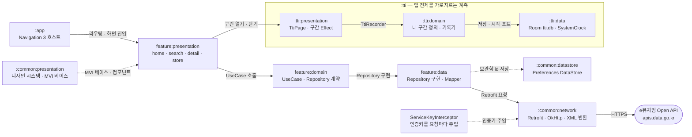
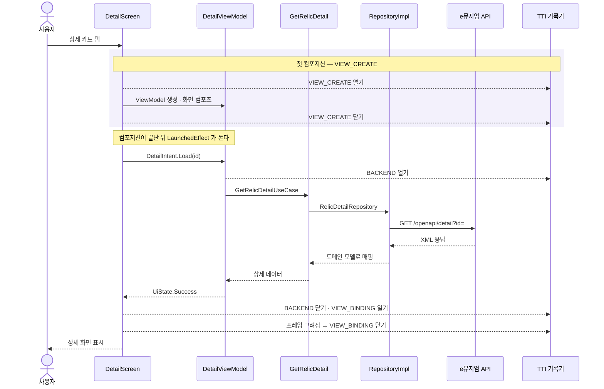

# EveryMuseum

안드로이드 권장 아키텍쳐 샘플 코드입니다.

국립중앙박물관 [e뮤지엄 Open API](https://www.emuseum.go.kr) 의 소장품을 둘러보는 앱이고,
멀티 모듈 · MVI · Navigation 3 · Hilt 로 구성돼 있습니다.

## 시스템 아키텍처

한 요청은 `:app` 의 라우팅 테이블에서 시작해 화면 → UseCase → Repository 계약 → 통신 스택 순으로
한 겹씩만 내려갑니다. 각 layer 는 바로 아래 layer 의 **계약**만 알고 구현은 모릅니다.



> 🔍 인터랙티브 버전: [`docs/architecture.html`](docs/architecture.html)
> 모듈을 눌러 의존 관계만 추리거나 `주요 요청 경로` · `공통 레이어` · `TTI 계측` 세 갈래로 나눠 볼 수 있습니다.
> (GitHub 은 저장소 안의 HTML 을 렌더링하지 않습니다 — 내려받아 브라우저에서 열어 주세요)

**레이어 규칙**

| 모듈 | 성격 | 아는 것 |
|---|---|---|
| `feature:presentation` | Compose + ViewModel | 입력은 `Intent` 하나, 출력은 `UiState` 하나 |
| `feature:domain` | 순수 코틀린 | UseCase 와 Repository **계약**만. 안드로이드 의존 없음 |
| `feature:data` | Android + Hilt | 그 계약의 구현. 응답을 도메인 모양으로 옮김 |
| `:common:network` | 공용 | 통신 스택 하나. 엔드포인트는 각 `data` 모듈이 정함 |
| `:tti:domain` | 순수 코틀린 | 무엇을 언제 재는가. 시각·저장은 포트로 위임 |

## 주요 경로 — 소장품 상세 조회

탭 한 번이 `Intent` 하나로 들어가고, 상태 하나가 돌아와 화면이 그려집니다.
그 위에 TTI 계측이 얹혀 각 구간의 시간을 따로 잽니다.



> 🔍 인터랙티브 버전: [`docs/use-case-detail.html`](docs/use-case-detail.html)
> 각 메시지에 붙은 주석과 `화면 진입` · `조회` · `그리기 · 계측 완료` 구간을 따로 볼 수 있습니다.

**이 경로에서 지키는 것**

- 라우트 인자는 생성자가 아니라 `Intent` 로 들어갑니다 — 딥링크·백스택 복원도 같은 길을 탑니다.
- 인증키는 `ServiceKeyInterceptor` 가 붙이고, 응답 XML 은 전용 컨버터가 파싱합니다.
- 없는 id 면 저장소가 예외를 던지고 화면은 에러 상태로 떨어집니다.

## 화면 진입 시간(TTI) 계측

`:tti` 는 화면 하나가 "쓸 수 있는 상태"가 되기까지를 네 구간으로 나눠 잽니다.

| 구간 | 재는 것 |
|---|---|
| `VIEW_CREATE` | 화면 진입 → ViewModel 생성 · 첫 컴포지션 |
| `BACKEND` | 서버 요청 → 응답 |
| `VIEW_BINDING` | 데이터로 다시 그리기 시작 → 그 프레임이 실제로 그려짐 |
| `BIG_PART_LOADING` | 사진처럼 뒤늦게 채워지는 큰 덩어리 |

합계는 처음과 끝의 차이가 아니라 **구간 길이의 합**입니다. 구간 사이에는 측정하지 않는
빈 시간이 끼어들 수 있고, 그것까지 TTI 로 세면 화면이 느려진 것처럼 보입니다.

에뮬레이터 실측 예시 (Logcat 태그는 `System.out`):

```
TTI: /home          total=7021ms (VIEW_CREATE=138ms | BACKEND=1258ms | VIEW_BINDING=56ms | BIG_PART_LOADING=5569ms)
TTI: /detail        total=1292ms (VIEW_CREATE=  7ms | BACKEND= 220ms | VIEW_BINDING= 9ms | BIG_PART_LOADING=1056ms)
TTI: /search/result total= 647ms (VIEW_CREATE=  8ms | BACKEND= 635ms | VIEW_BINDING= 4ms | BIG_PART_LOADING=   0ms)
```

```bash
adb logcat | grep "TTI:"
```

## 빌드

인증키와 주소는 소스에 두지 않고 `local.properties` 에서만 읽습니다
(`common/network/build.gradle.kts` 가 `BuildConfig` 로 굽습니다).

```properties
EMUSEUM_BASE_URL=https://apis.data.go.kr/.../
EMUSEUM_SERVICE_KEY=발급받은_인증키
```

```bash
./gradlew :app:assembleDebug
./gradlew :tti:domain:test
```

---

다이어그램 원본은 [`docs/diagrams/`](docs/diagrams) 의 JSON 이고,
[archify](https://github.com/tt-a1i/archify) 로 `docs/*.html` 을 만듭니다.
