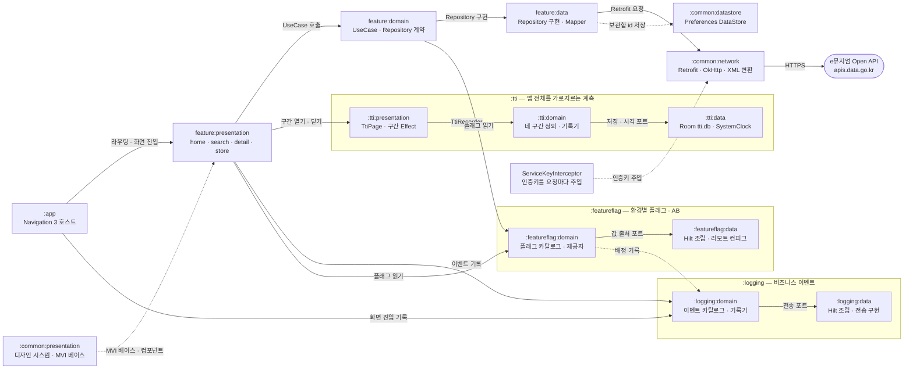
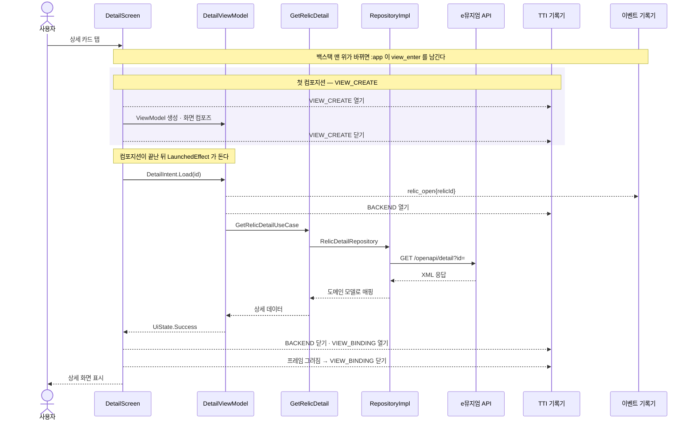

# EveryMuseum

안드로이드 권장 아키텍쳐 샘플 코드입니다.

국립중앙박물관 [e뮤지엄 Open API](https://www.emuseum.go.kr) 의 소장품을 둘러보는 앱이고,
멀티 모듈 · MVI · Navigation 3 · Hilt 로 구성돼 있습니다.

화면 진입 시간(TTI) 계측, 비즈니스 이벤트 로깅, 환경별 피처 플래그 · AB 테스트가
앱 전체를 가로지르는 모듈로 따로 있습니다.

## 시스템 아키텍처

한 요청은 `:app` 의 라우팅 테이블에서 시작해 화면 → UseCase → Repository 계약 → 통신 스택 순으로
한 겹씩만 내려갑니다. 각 layer 는 바로 아래 layer 의 **계약**만 알고 구현은 모릅니다.


```mermaid
flowchart LR
    app[":app<br/>Navigation 3 호스트"]
    cp[":common:presentation<br/>디자인 시스템 · MVI 베이스"]
    fp["feature:presentation<br/>home · search · detail · store"]
    fd["feature:domain<br/>UseCase · Repository 계약"]
    fdata["feature:data<br/>Repository 구현 · Mapper"]
    key["ServiceKeyInterceptor<br/>인증키를 요청마다 주입"]
    net[":common:network<br/>Retrofit · OkHttp · XML 변환"]
    ds[":common:datastore<br/>Preferences DataStore"]
    api(["e뮤지엄 Open API<br/>apis.data.go.kr"])

    app -->|라우팅 · 화면 진입| fp
    fp -->|UseCase 호출| fd
    fd -->|Repository 구현| fdata
    fdata -->|Retrofit 요청| net
    net -->|HTTPS| api

    cp -.->|MVI 베이스 · 컴포넌트| fp
    key -.->|인증키 주입| net
    fdata -.->|보관함 id 저장| ds

    subgraph TTI[":tti — 앱 전체를 가로지르는 계측"]
        direction LR
        tp[":tti:presentation<br/>TtiPage · 구간 Effect"]
        td[":tti:domain<br/>네 구간 정의 · 기록기"]
        tdata[":tti:data<br/>Room tti.db · SystemClock"]
        tp -->|TtiRecorder| td
        td -->|저장 · 시각 포트| tdata
    end

    subgraph LOG[":logging — 비즈니스 이벤트"]
        direction LR
        ld[":logging:domain<br/>이벤트 카탈로그 · 기록기"]
        ldata[":logging:data<br/>Hilt 조립 · 전송 구현"]
        ld -->|전송 포트| ldata
    end

    subgraph FLAG[":featureflag — 환경별 플래그 · AB"]
        direction LR
        fl[":featureflag:domain<br/>플래그 카탈로그 · 제공자"]
        fldata[":featureflag:data<br/>Hilt 조립 · 리모트 컨피그"]
        fl -->|값 출처 포트| fldata
    end

    fp -->|구간 열기 · 닫기| tp
    fp -->|이벤트 기록| ld
    app -->|화면 진입 기록| ld
    fp -->|플래그 읽기| fl
    fd -->|플래그 읽기| fl
    fl -.->|배정 기록| ld
```

> 🔍 인터랙티브 버전: [`docs/architecture.html`](docs/architecture.html)
> 모듈을 눌러 의존 관계만 추리거나 `주요 요청 경로` · `공통 레이어` · `TTI 계측` · `가로지르는 모듈`
> 네 갈래로 나눠 볼 수 있습니다.
> (GitHub 은 저장소 안의 HTML 을 렌더링하지 않습니다 — 내려받아 브라우저에서 열어 주세요)

**레이어 규칙**

| 모듈 | 성격 | 아는 것 |
|---|---|---|
| `feature:presentation` | Compose + ViewModel | 입력은 `Intent` 하나, 출력은 `UiState` 하나 |
| `feature:domain` | 순수 코틀린 | UseCase 와 Repository **계약**만. 안드로이드 의존 없음 |
| `feature:data` | Android + Hilt | 그 계약의 구현. 응답을 도메인 모양으로 옮김 |
| `:common:network` | 공용 | 통신 스택 하나. 엔드포인트는 각 `data` 모듈이 정함 |
| `:tti:domain` | 순수 코틀린 | 무엇을 언제 재는가. 시각·저장은 포트로 위임 |
| `:logging:domain` | 순수 코틀린 | 무엇을 남길 수 있는가. 전송은 포트로 위임 |
| `:featureflag:domain` | 순수 코틀린 | 어떤 플래그·실험이 있는가. 값 출처는 포트로 위임 |

## 주요 경로 — 소장품 상세 조회

탭 한 번이 `Intent` 하나로 들어가고, 상태 하나가 돌아와 화면이 그려집니다.
그 위에 TTI 계측이 얹혀 각 구간의 시간을 따로 재고, 비즈니스 이벤트가 따로 나갑니다.


```mermaid
sequenceDiagram
    actor U as 사용자
    participant S as DetailScreen
    participant VM as DetailViewModel
    participant UC as GetRelicDetail
    participant R as RepositoryImpl
    participant API as e뮤지엄 API
    participant T as TTI 기록기
    participant B as 이벤트 기록기

    U->>S: 상세 카드 탭
    Note over S,B: 백스택 맨 위가 바뀌면 :app 이 view_enter 를 남긴다

    rect rgba(140,120,220,0.10)
    Note over S,T: 첫 컴포지션 — VIEW_CREATE
    S-->>T: VIEW_CREATE 열기
    S->>VM: ViewModel 생성 · 화면 컴포즈
    S-->>T: VIEW_CREATE 닫기
    end

    Note over S,VM: 컴포지션이 끝난 뒤 LaunchedEffect 가 돈다
    S->>VM: DetailIntent.Load(id)
    VM-->>B: relic_open{relicId}
    VM-->>T: BACKEND 열기
    VM->>UC: GetRelicDetailUseCase
    UC->>R: RelicDetailRepository
    R->>API: GET /openapi/detail?id=
    API-->>R: XML 응답
    R-->>UC: 도메인 모델로 매핑
    UC-->>VM: 상세 데이터
    VM-->>S: UiState.Success
    S-->>T: BACKEND 닫기 · VIEW_BINDING 열기
    S-->>T: 프레임 그려짐 → VIEW_BINDING 닫기
    S-->>U: 상세 화면 표시
```

> 🔍 인터랙티브 버전: [`docs/use-case-detail.html`](docs/use-case-detail.html)
> 각 메시지에 붙은 주석과 `화면 진입` · `조회` · `그리기 · 계측 완료` · `이벤트 로깅` 갈래를
> 따로 볼 수 있습니다.

**이 경로에서 지키는 것**

- 라우트 인자는 생성자가 아니라 `Intent` 로 들어갑니다 — 딥링크·백스택 복원도 같은 길을 탑니다.
- 인증키는 `ServiceKeyInterceptor` 가 붙이고, 응답 XML 은 전용 컨버터가 파싱합니다.
- 없는 id 면 저장소가 예외를 던지고 화면은 에러 상태로 떨어집니다.

## 화면 진입 시간(TTI) 계측

`:tti` 는 화면 하나가 "쓸 수 있는 상태"가 되기까지를 네 구간으로 나눠 잽니다.

| 구간 | 재는 것 |
|---|---|
| `VIEW_CREATE` | 화면 진입 → ViewModel 생성 · 첫 컴포지션 |
| `BACKEND` | 서버 요청 → 응답 |
| `VIEW_BINDING` | 데이터로 다시 그리기 시작 → 그 프레임이 실제로 그려짐 |
| `BIG_PART_LOADING` | 사진처럼 뒤늦게 채워지는 큰 덩어리 |

합계는 처음과 끝의 차이가 아니라 **구간 길이의 합**입니다. 구간 사이에는 측정하지 않는
빈 시간이 끼어들 수 있고, 그것까지 TTI 로 세면 화면이 느려진 것처럼 보입니다.

에뮬레이터 실측 예시 (Logcat 태그는 `System.out`):

```
TTI: /home          total=7021ms (VIEW_CREATE=138ms | BACKEND=1258ms | VIEW_BINDING=56ms | BIG_PART_LOADING=5569ms)
TTI: /detail        total=1292ms (VIEW_CREATE=  7ms | BACKEND= 220ms | VIEW_BINDING= 9ms | BIG_PART_LOADING=1056ms)
TTI: /search/result total= 647ms (VIEW_CREATE=  8ms | BACKEND= 635ms | VIEW_BINDING= 4ms | BIG_PART_LOADING=   0ms)
```

```bash
adb logcat | grep "TTI:"
```

## 비즈니스 이벤트 로깅

`:logging` 은 사용자가 무엇을 했는지를 남깁니다. TTI 와 달리 쌓아 두지 않습니다 —
`record` 한 건이 그대로 한 번의 전송입니다.

남길 수 있는 이벤트는 `BizEvent` 한 곳에 모여 있고 sealed 라, 카탈로그에 없는 이벤트는
아예 남길 수 없습니다. 딸리는 값도 이벤트가 생성자로 받으므로 빠뜨리면 컴파일이 멈춥니다.

| 이벤트 | 값 | 남기는 곳 |
|---|---|---|
| `ViewEnter` | `from` | 백스택 맨 위가 바뀔 때 `:app` 에서 한 번에 |
| `RelicOpen` | `relicId` | 상세 조회 시작 |
| `SaveToggle` | `relicId` · `saved` | 홈 · 검색 결과 · 상세 · 보관함 |
| `SearchSubmit` | `query` | 검색 · 검색 결과 |
| `SearchRecentClear` | 없음 | 검색 |
| `FilterApply` | `tabCode` · `optionCodes` | 검색 결과 |
| `EraSelect` | `eraCode` | 홈 |
| `LayoutToggle` | `layout` | 보관함 |
| `FlagsResolved` | `environment` · 배정 전부 | 플래그를 받아 온 직후 `:featureflag` 에서 |
| `AbExposed` | `experiment` · `variant` | 그 변형이 실제로 화면에 쓰인 자리 |

```kotlin
bizLogger.record(DetailPage.PATH, BizEvent.RelicOpen(relicId = id))
```

화면 이름은 TTI 의 `pageName` 과 같은 경로 상수입니다 — 두 지표를 같은 화면 기준으로
겹쳐 볼 수 있어야 하기 때문입니다. 같은 행동이라도 어느 화면에서 일어났는지로 갈립니다.

출력 형식 (Logcat 태그는 `System.out`):

```
BIZLOG: /home view_enter user=2b7f3c9a-4d51-4e08-9a6b-1c0f5e83d7a2 at=1789516812031 {from=null}
BIZLOG: /home era_select user=2b7f3c9a-4d51-4e08-9a6b-1c0f5e83d7a2 at=1789516819447 {eraCode=PS01}
BIZLOG: /detail relic_open user=2b7f3c9a-4d51-4e08-9a6b-1c0f5e83d7a2 at=1789516824903 {relicId=PS0100100100100119900000}
BIZLOG: /detail save_toggle user=2b7f3c9a-4d51-4e08-9a6b-1c0f5e83d7a2 at=1789516831118 {relicId=PS0100100100100119900000, saved=true}
```

```bash
adb logcat | grep "BIZLOG:"
```

## 피처 플래그 · AB 테스트

`:featureflag` 는 리모트 컨피그에서 값을 받아 플래그와 실험 배정을 읽습니다.
순수 코틀린이라 화면뿐 아니라 UseCase 도 같은 제공자를 생성자 주입으로 받습니다.

```kotlin
class GetHomeRelicsUseCase @Inject constructor(
    private val homeContentRepository: HomeContentRepository,
    private val featureFlags: FeatureFlagProvider,
) {
    suspend operator fun invoke(eraCode: String? = null) = homeContentRepository.getHomeRelics(
        eraCode = eraCode,
        pageSize = featureFlags.get(FlagKey.HomePageSize),
    )
}
```

무엇이 있는지는 `FlagKey` 한 곳에서 봅니다. 키 하나가 이름 · 타입 · 기본값을 함께 지니므로
부르는 쪽에 캐스팅도 기본값 처리도 없습니다.

| 플래그 | 타입 | 안정 | 쓰는 곳 |
|---|---|---|---|
| `NewOnboarding` | `Boolean` | 예 | 온보딩 개편 스위치 |
| `HomePageSize` | `Int` | 예 | 홈 조회 행 수 |
| `HomeBanner` | `HomeBannerVO` | 예 | 홈 배너 문구 · 링크 |
| `SearchRetryCount` | `Int` | 아니오 | 검색 재시도 |
| `FetchTimeoutMillis` | `Long` | 아니오 | 네트워크 타임아웃 |
| `RetryBackoffMillis` | `List<Long>` | 아니오 | 재시도 간격 |
| `LibraryLayoutAb` | `LibraryLayoutVariant` | 예 | 보관함 첫 보기 실험 |

**타입을 `KSerializer` 로 들고 다니는 이유**

`Class<T>` 는 제네릭을 지웁니다. `List<Long>` 을 `Class` 로 적으면 원소가 `Long` 인지 알 수 없어
원소 타입을 따로 받아야 하고, 값은 돌아오는 길에 `Any` 를 거칩니다.
`KSerializer` 는 원소 타입까지 담고 있어 원시 타입 · 리스트 · JSON 객체를 한 방법으로 읽습니다.

```kotlin
data object RetryBackoffMillis : FlagKey<List<Long>>(
    key = "retry_backoff_ms",
    serializer = ListSerializer(Long.serializer()),
    defaultValue = listOf(1_000L, 2_000L, 4_000L),
    stable = false,
)
```

읽을 때는 리모트 값을 `JsonElement` 로 모아 그 직렬화기 하나로 해석합니다.
분기마다 캐스팅하지 않으므로 선언한 타입과 어긋나는 조합을 쓸 수 없고, enum 변형이 그대로 따라옵니다.
그래서 AB 변형은 문자열이 아니라 enum 이고, 쓰는 쪽의 `when` 은 컴파일러가 검사합니다.

**안정과 비안정**

`stable` 은 "한 실행 동안 바뀌지 않아도 되는가" 입니다. 안정된 것은 `init` 이 받아 둔 값을 왕복 없이
쓰고, 아닌 것은 읽을 때마다 다시 가져오되 왕복이 실패하면 마지막으로 성공한 값을 내놓습니다.
화면 구성을 가르는 값이 도중에 바뀌면 같은 사용자가 두 화면을 다르게 보고,
운영값이 네트워크가 끊겼다고 초기값으로 되돌아가면 고쳐 둔 타임아웃이 그 자리에서 풀립니다.

**환경**

`dev` · `qa` · `prod` 는 빌드 플레이버이고, 리모트 키 꼬리로 갈립니다.
찾는 순서는 아래로만 흐릅니다 — `dev` 는 자기 값이 없으면 `qa`, 그다음 `prod` 를 주워 쓰고
`prod` 는 위를 보지 않습니다. 같은 값을 환경마다 적어 두지 않아도 되고,
`dev` 에서 켜 본 실험이 `prod` 사용자에게 새지도 않습니다.

```
home_page_size_dev → home_page_size_qa → home_page_size_prod → FlagKey.defaultValue
```

배정은 `init` 안에서 곧바로 로그로 나갑니다. 부르는 쪽에 맡기면 빠뜨릴 수 있고,
그러면 어떤 사용자가 어떤 실험에 있었는지 나중에 되짚을 수 없습니다.
사용자 식별자는 `:logging` 이 기록마다 붙입니다.

```
BIZLOG: /app flags_resolved user=2b7f3c9a-4d51-4e08-9a6b-1c0f5e83d7a2 at=1789516811004 {environment=dev, flag_new_onboarding=true, flag_home_page_size=5, flag_ab_library_default_layout=GRID}
```

지금 값 출처는 앱 안에 둔 샘플 구현입니다. `google-services.json` 을 넣고
`RemoteConfigSource` 구현만 Firebase 것으로 바꾸면 읽는 쪽 코드는 그대로입니다.


**이 모듈에서 지키는 것**

- 사용자 UUID 는 앱 실행당 하나이고, 기록기가 아니라 **건마다** 붙습니다 — 전송이 도는 사이에
  `makeUUID` 로 사용자가 바뀌어도 먼저 기록된 건은 원래 주인을 답니다.
- 전송은 한 줄로 세워 일어난 순서대로 내보냅니다. 병렬성 1 만으로는 부족합니다 —
  전송기가 네트워크에서 멈추면 다음 건이 앞질러 나갑니다.
- 실패한 건은 그대로 사라집니다. 쌓아 두는 곳이 없으므로 재시도는 전송기 구현의 몫입니다.


## 빌드

인증키와 주소는 소스에 두지 않고 `local.properties` 에서만 읽습니다
(`common/network/build.gradle.kts` 가 `BuildConfig` 로 굽습니다).

```properties
EMUSEUM_BASE_URL=https://apis.data.go.kr/.../
EMUSEUM_SERVICE_KEY=발급받은_인증키
```

환경은 빌드 플레이버로 고릅니다.

```bash
./gradlew :app:assembleDevDebug
./gradlew :app:assembleQaDebug
./gradlew :app:assembleProdRelease

./gradlew :tti:domain:test
./gradlew :logging:domain:test
./gradlew :featureflag:domain:test
```

---

다이어그램 원본은 [`docs/diagrams/`](docs/diagrams) 의 JSON 이고,
[archify](https://github.com/tt-a1i/archify) 로 `docs/*.html` 을 만듭니다.
